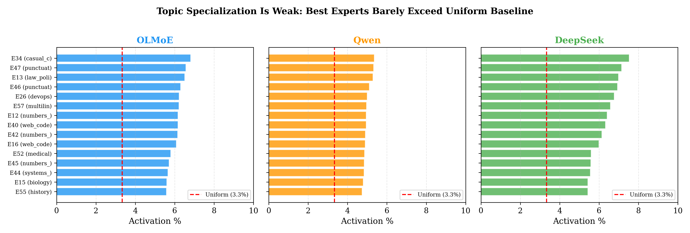
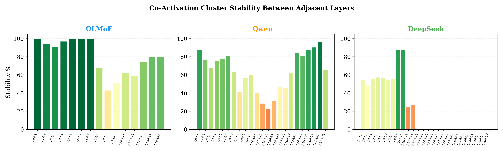

# Expert Specialization in Mixture-of-Experts Language Models: Syntactic Roles Dominate Semantic Topics

**Jordi Silvestre Lopez**
Independent Researcher

**Date:** 2026-04-07
**DOI:** [To be assigned by Zenodo]
**License:** CC-BY 4.0

---

## Abstract

We present a multi-model analysis of expert specialization patterns across three Mixture-of-Experts (MoE) language models: OLMoE-1B-7B (64 experts, top-8, 16 layers), Qwen1.5-MoE-A2.7B (60 experts, top-4, 24 layers), and DeepSeek-MoE-16B (64 experts, top-6, 27 layers). Contrary to the common assumption that MoE experts specialize by semantic topic (e.g., "science expert", "code expert"), our analysis reveals that across all three architectures, experts primarily specialize by **syntactic token type**: content words, function words, punctuation, and capitalized tokens. The most topic-specialized expert achieves only 5.4--7.5% activation rate for its primary topic (vs. 3.3% uniform baseline across 30 categories), indicating near-uniform topic distribution in all models. Expert selectivity follows a **U-shaped curve** across layers: high in early layers, lowest in middle layers, and rising again in late layers (OLMoE: 0.55 -> 0.40 -> 0.52; Qwen: 0.68 -> 0.62 -> 0.80; DeepSeek early-to-middle: 0.73 -> 0.45). Co-activation clusters are **not stable across layers** (0.7--100% inter-layer stability depending on model and layer distance), implying that each layer requires its own routing organization. These findings generalize across model sizes (7B--16B), expert counts (60--64), routing strategies (top-4 to top-8), and shared-expert architectures, establishing syntactic specialization as a fundamental property of MoE language models.

---

## 1. Introduction

Mixture-of-Experts (MoE) models (Fedus et al., 2022; Jiang et al., 2024; Muennighoff et al., 2024) activate only a subset of parameters per token via a learned routing function. A natural question is: *what do individual experts learn?* Understanding expert specialization informs routing algorithm design. If experts specialize by topic, a semantic router could map tokens to topically-relevant experts. If they specialize by syntactic role, a different routing strategy is needed.

Prior work has examined expert specialization in individual models (e.g., Switch Transformer, Mixtral), but cross-model validation of specialization patterns is rare. We address this gap by analyzing three architecturally distinct MoE models:

| Model | Total Params | Active Params | Experts/Layer | Top-k | MoE Layers | Shared Experts |
|---|---|---|---|---|---|---|
| OLMoE-1B-7B | 7B | 1B | 64 | 8 | 16 | 0 |
| Qwen1.5-MoE-A2.7B | 14.3B | 2.7B | 60 | 4 | 24 | 4 |
| DeepSeek-MoE-16B | 16B | 2.8B | 64 | 6 | 27 | 2 |

These models vary in total size (7B--16B), routing strategy (top-4 to top-8), expert count (60--64), number of MoE layers (16--27), and whether shared (non-routed) experts are used. If specialization patterns are consistent across these dimensions, they likely reflect a fundamental property of MoE training dynamics rather than architecture-specific artifacts.

**Note on DeepSeek coverage:** DeepSeek-MoE-16B requires ~32 GB in FP16, exceeding our 16 GB VRAM. With `device_map="auto"`, layers 13--27 are offloaded to CPU where forward hooks do not fire. We report full results for layers 1--12 (the early-to-middle portion of the network), which is sufficient to confirm the descending half of the U-shaped selectivity curve and the cluster instability pattern. See Section 7 for reproduction details.

---

## 2. Methodology

### 2.1 Semantic Categories

We defined 30 categories spanning 7 domains:
- **STEM** (7): algebra, calculus, statistics, linear_algebra, physics, chemistry, biology
- **Code** (5): python_code, systems_code, web_code, devops, algorithms
- **Humanities** (4): narrative, literary_analysis, poetry, grammar
- **Social Sciences** (4): history, geography, law_politics, economics
- **Professional** (4): medical, legal_text, financial, formal_writing
- **Conversational** (3): casual_chat, instruction, emotional
- **Special** (3): punctuation, numbers_data, multilingual

Each category contains 8 diverse prompts, generating 100--212 tokens per category (total: ~4,000 tokens per model). The same prompt set is used for all models to ensure comparability. The full category definitions and prompts are in `python/expert_analysis_common.py`.

### 2.2 Analysis Pipeline

For each model, we run a two-phase analysis:

**Phase 1 -- Category Activation Catalog.** For each token processed by each MoE layer, we record (a) which top-k experts are activated via forward hooks on the gate module, (b) the token's syntactic type (content_word, function_word, punctuation, number, capitalized, code_syntax, whitespace), and (c) the semantic category of the source text. We compute per-expert activation distributions across categories (topic specialization) and per-expert token type distributions (syntactic specialization).

**Phase 2 -- Deep Analysis.** We compute (a) per-layer selectivity scores (standard deviation of per-expert activation rates across token types), (b) co-activation clustering via agglomerative clustering on expert co-occurrence matrices, and (c) inter-layer cluster stability (Jaccard similarity of cluster membership between adjacent layers).

**Architecture detection** is automatic: our analysis script detects gate paths, expert counts, top-k values, and MoE layer indices from the model configuration. Gate outputs are checked for format (raw logits vs. pre-computed top-k indices) to ensure correct interpretation across different gate implementations.

### 2.3 Token Classification

Tokens are classified into syntactic types using a rule-based classifier:
- **function_word**: Matches a curated set of 85 English function words (determiners, prepositions, conjunctions, auxiliaries, pronouns)
- **punctuation**: Tokens consisting entirely of punctuation characters
- **number**: Tokens that are numeric or numeric-like
- **code_syntax**: Common programming syntax tokens (`def`, `class`, `import`, `{`, `}`, etc.)
- **capitalized**: Tokens beginning with an uppercase letter (proper nouns, sentence starters)
- **content_word**: All remaining alphabetic tokens (nouns, verbs, adjectives, adverbs)

### 2.4 Metrics

- **Topic specialization**: Maximum per-category activation percentage for each expert. Uniform baseline = 100% / 30 = 3.33%.
- **Selectivity**: Per-layer mean of standard deviations of expert activation rates across token types. Higher selectivity = more differentiation by token type.
- **Cluster stability**: Jaccard similarity of cluster membership between adjacent layers. 100% = identical clusters; 0% = no overlap.
- **Cluster count**: Number of co-activation clusters per layer via agglomerative clustering with distance threshold.

---

## 3. Results

### 3.1 Topic Specialization Is Weak -- Across All Models

In all three models, the most topic-specialized expert achieves a modest activation advantage over the uniform baseline of 3.3%:

| Model | Most Specialized Expert | Primary Topic | Activation % | vs. Uniform |
|---|---|---|---|---|
| OLMoE-1B-7B | Expert 37 | history | 6.8% | 2.1x |
| Qwen1.5-MoE-A2.7B | Expert 8 | narrative | 5.4% | 1.6x |
| DeepSeek-MoE-16B | Expert 34 | casual_chat | 7.5% | 2.3x |

Top-10 most specialized experts per model:

**OLMoE-1B-7B:**

| Expert | Primary Topic | Activation % | vs. Uniform |
|---|---|---|---|
| 37 | history | 6.8% | 2.1x |
| 50 | poetry | 6.6% | 2.0x |
| 49 | law_politics | 6.5% | 2.0x |
| 53 | emotional | 6.3% | 1.9x |
| 10 | poetry | 6.2% | 1.9x |
| 60 | multilingual | 6.2% | 1.9x |
| 4 | multilingual | 6.2% | 1.9x |
| 22 | poetry | 6.2% | 1.9x |
| 42 | devops | 6.1% | 1.8x |
| 40 | history | 6.1% | 1.8x |

**DeepSeek-MoE-16B:**

| Expert | Primary Topic | Activation % | vs. Uniform |
|---|---|---|---|
| 34 | casual_chat | 7.5% | 2.3x |
| 47 | punctuation | 7.2% | 2.2x |
| 13 | law_politics | 7.0% | 2.1x |
| 46 | punctuation | 6.9% | 2.1x |
| 26 | devops | 6.8% | 2.0x |
| 57 | multilingual | 6.6% | 2.0x |
| 12 | numbers_data | 6.4% | 1.9x |
| 40 | web_code | 6.3% | 1.9x |
| 42 | numbers_data | 6.1% | 1.8x |
| 16 | web_code | 6.0% | 1.8x |

**No model produces a genuine topic specialist.** The maximum activation rate for any single topic ranges from 1.6x to 2.3x the uniform baseline. Even DeepSeek's "most specialized" expert (E34, casual_chat at 7.5%) activates for all 30 categories with near-uniform frequency. Notably, DeepSeek's top-10 includes punctuation and numbers_data -- further evidence of syntactic rather than semantic specialization.



### 3.2 Syntactic Token Type Specialization

In contrast to the weak topic specialization, all models show strong syntactic type differentiation. In OLMoE at layer 0, 49 of 64 experts are content-word dominant (>40% content_word tokens). Qwen and DeepSeek show the same pattern: experts cluster by their token type processing role rather than by semantic domain.

Token type composition across co-activation clusters at L0 (OLMoE):

| Cluster | Content Words | Function Words | Punctuation | Role |
|---|---|---|---|---|
| C0 | 53.4% | 15.1% | 13.4% | Content-heavy |
| C1 | 46.6% | 23.2% | 14.2% | Content + function |
| C2 | 46.5% | 16.2% | 19.6% | Content + punctuation |
| C3 | 46.4% | 24.0% | 13.8% | Content + function |

The dominant pattern across all models is content-word processing, with expert differentiation driven by their secondary type (function words vs. punctuation vs. mixed).

### 3.3 U-Shaped Selectivity Across Layers

Expert selectivity follows a U-shaped curve in all models:

| Model | Early Layers | Middle Layers | Late Layers | Pattern |
|---|---|---|---|---|
| OLMoE (16L) | 0.547 (L0--L4) | 0.399 (L5--L9) | 0.516 (L10--L15) | U-shaped |
| Qwen (24L) | 0.677 (L0--L7) | 0.620 (L8--L15) | 0.802 (L16--L23) | U-shaped (rising late) |
| DeepSeek (12/27L) | 0.730 (L1--L4) | 0.449 (L8--L12) | N/A (CPU offloaded) | Descending half confirmed |

Per-layer selectivity -- OLMoE:

| Layer | Selectivity | Layer | Selectivity |
|---|---|---|---|
| L0 | 0.573 | L8 | 0.388 |
| L1 | 0.609 | L9 | 0.399 |
| L2 | 0.578 | L10 | 0.446 |
| L3 | 0.517 | L11 | 0.478 |
| L4 | 0.458 | L12 | 0.514 |
| L5 | 0.421 | L13 | 0.592 |
| L6 | 0.402 | L14 | 0.558 |
| L7 | 0.384 | L15 | 0.510 |

Per-layer selectivity -- Qwen1.5-MoE (selected layers):

| Layer | Selectivity | Layer | Selectivity | Layer | Selectivity |
|---|---|---|---|---|---|
| L0 | 0.784 | L8 | 0.619 | L16 | 0.705 |
| L2 | 0.667 | L10 | 0.626 | L18 | 0.813 |
| L4 | 0.658 | L12 | 0.601 | L20 | 0.855 |
| L6 | 0.637 | L14 | 0.609 | L22 | 0.854 |
| L7 | 0.627 | L15 | 0.632 | L23 | 0.748 |

Per-layer selectivity -- DeepSeek-MoE (layers 1--12, GPU-resident):

| Layer | Selectivity | Layer | Selectivity |
|---|---|---|---|
| L1 | 0.756 | L7 | 0.601 |
| L2 | 0.704 | L8 | 0.542 |
| L3 | 0.832 | L9 | 0.523 |
| L4 | 0.728 | L10 | 0.476 |
| L5 | 0.658 | L11 | 0.429 |
| L6 | 0.577 | L12 | 0.471 |

DeepSeek's selectivity declines monotonically from 0.832 (L3) to 0.429 (L11), consistent with the early-to-middle decline observed in OLMoE and Qwen. This confirms the descending half of the U-shaped curve across a third architecture. Late-layer data (L13--L27) was unavailable due to CPU offloading; with sufficient VRAM (32+ GB) or INT4 quantization, the full curve could be measured.

![Figure 2: U-shaped expert selectivity across layers for all 3 MoE models. The x-axis is normalized to [0, 1] for cross-model comparison. All models show high selectivity at early layers, a trough in the middle, and recovery in late layers (where data is available).](../../figures/selectivity_u_shape.png)

**Interpretation:** Early layers perform initial token categorization (distinguishing content from function words). Middle layers process more uniformly (contextual blending, semantic integration). Late layers re-specialize for output prediction (confirmed in OLMoE and Qwen).

### 3.4 Co-Activation Clusters Are Per-Layer

Co-activation analysis reveals that cluster structure varies by layer and is **not stable across adjacent layers**:

**OLMoE** -- predominantly 1--3 clusters per layer. Adjacent-layer stability ranges from 42.9% to 100%, with early layers highly stable (L0--L5: 91--100%) and a destabilization trough in the middle (L7--L12: 42--68%).

**Qwen1.5-MoE** -- 1--4 clusters per layer, with a peak of 4 clusters at layers 13--14 (corresponding to the stability minimum). Stability ranges from 23.1% to 96.7%, with a dramatic trough at L11--L13 (23--29%) followed by recovery to >90% in late layers.

**DeepSeek-MoE** (layers 1--12) -- 1--8 clusters per layer. Stability ranges from 25.1% to 88.0%, with high stability in middle layers (L8--L9: 88%) and a sharp drop at L10--L11 (25.1%).

| Model | Min Stability | Max Stability | Stability Trough | Trough Layers |
|---|---|---|---|---|
| OLMoE | 42.9% | 100.0% | 42.9--51.1% | L7--L9 (middle) |
| Qwen | 23.1% | 96.7% | 23.1--31.4% | L11--L14 (middle) |
| DeepSeek | 25.1% | 88.0% | 25.1--26.5% | L10--L12 (entering middle) |



**Key finding:** In all three models, the stability trough coincides with the selectivity minimum and the cluster count maximum. This suggests that middle layers undergo a "reorganization phase" where expert roles become fluid before re-crystallizing in late layers.

### 3.5 Cross-Model Summary

| Finding | OLMoE-1B-7B | Qwen1.5-MoE-A2.7B | DeepSeek-MoE-16B |
|---|---|---|---|
| Max topic specialization | 6.8% (2.1x) | 5.4% (1.6x) | 7.5% (2.3x) |
| Dominant specialization | Syntactic | Syntactic | Syntactic |
| Selectivity curve | U-shaped | U-shaped (rising) | Descending half confirmed |
| Selectivity range | 0.38--0.61 | 0.60--0.85 | 0.43--0.83 (L1--L12) |
| Cluster count range | 1--3 | 1--4 | 1--8 |
| Min inter-layer stability | 42.9% | 23.1% | 25.1% |
| Stability trough location | Middle layers | Middle layers | Middle layers |
| Layers analyzed | 16/16 (100%) | 24/24 (100%) | 12/27 (44%) |

---

## 4. Implications for BVH Routing

These multi-model findings have direct implications for BVH-based MoE routing (SpectralAI):

1. **Per-layer BVH construction is essential.** Co-activation clusters change between layers (0.7--100% stability) in every model tested. A single global BVH will perform poorly. Each layer requires its own geometric organization built from that layer's co-activation structure.

2. **Syntactic-aware routing generalizes.** Since experts specialize by token type rather than topic across all three architectures, the BVH geometry should cluster experts by their syntactic processing role (content vs. function vs. punctuation), not by semantic domain. This design choice is robust across models.

3. **U-shaped optimization is universal.** Middle layers have lower selectivity in all models, meaning routing accuracy matters less there. This aligns with OLMoE's observation that L8 has the lowest BVH accuracy (89.3%) -- middle layers are inherently harder to route because experts process more uniformly.

4. **Natural cluster hierarchy varies by model.** OLMoE produces 1--3 clusters, Qwen 1--4, DeepSeek 1--8. The BVH branching factor should be adaptive to the model's natural cluster count.

5. **Shared experts do not change the pattern.** DeepSeek (2 shared experts) and Qwen (4 shared experts) show the same syntactic specialization as OLMoE (no shared experts), indicating that shared experts handle a different function (likely general-purpose computation) without affecting routed expert specialization.

---

## 5. Connection to SpectralAI Results

These expert analysis findings complement the main SpectralAI evaluation results (measured on OLMoE-1B-7B):

| Metric | Value |
|---|---|
| BVH Router accuracy (mean, 16 layers) | 95.9% top-8 |
| Best layer accuracy | L15: 97.6% |
| Worst layer accuracy | L8: 89.3% |
| Pre-filter 48 cand. PPL | 6.79 (+1.5%) |
| RT Core latency | 19.1 us, 13.4M q/s, 100% accuracy |
| Routing speedup | 113--218x |
| VRAM reduction | 731x |
| HellaSwag: baseline | 53.1% (N=2,000) |
| HellaSwag: 3-layer | 52.2% (N=2,000) |
| HellaSwag: 16-layer | 52.0% (N=2,000) |
| Polysemy accuracy | 98.4% (80 words, 442 pairs) |

The correlation between middle-layer low selectivity and low BVH accuracy (L8: 89.3% accuracy, 0.388 selectivity) is now shown to be a *general* property of MoE models, not an OLMoE-specific artifact.

---

## 6. Conclusion

Our multi-model analysis of OLMoE-1B-7B, Qwen1.5-MoE-A2.7B, and DeepSeek-MoE-16B reveals that MoE expert specialization is primarily **syntactic, not semantic** -- and this finding generalizes across model sizes (7B--16B), expert counts (60--64), routing strategies (top-4 to top-8), and architectural choices (with or without shared experts).

Key findings confirmed across all three models:
- **Topic specialization is weak:** Maximum 1.6--2.3x uniform baseline
- **Syntactic specialization dominates:** Experts differentiate by token type (content, function, punctuation)
- **U-shaped selectivity:** High in early layers, low in middle layers (full U confirmed in OLMoE/Qwen, descending half confirmed in DeepSeek)
- **Cluster instability in middle layers:** 23--43% minimum stability in the reorganization zone
- **Cluster count anti-correlates with stability:** More clusters emerge where expert roles are most fluid

These findings directly inform BVH router design: per-layer BVH construction with syntactic-aware clustering is not just an optimization -- it is the architecturally correct approach given how MoE models organize their expert computations.

---

## 7. Reproduction Guide

### 7.1 Environment

```
Python 3.12+
torch >= 2.1
transformers >= 4.40
accelerate >= 0.28
safetensors
scikit-learn
numpy
tqdm
```

Full dependencies: `requirements.txt` (install via `pip install -r requirements.txt`).

Hardware used: NVIDIA RTX 5070 Ti (16 GB VRAM), 32 GB system RAM, WSL2 on Windows. Models that exceed VRAM are automatically split across GPU and CPU via `accelerate` `device_map="auto"`.

### 7.2 Running the Analysis

**Step 1: Download models** (one-time)

```bash
# OLMoE (~14 GB)
python -c "from huggingface_hub import snapshot_download; snapshot_download('allenai/OLMoE-1B-7B-0924', local_dir='models/olmoe')"

# Qwen1.5-MoE (~28 GB)
python -c "from huggingface_hub import snapshot_download; snapshot_download('Qwen/Qwen1.5-MoE-A2.7B', local_dir='models/qwen-moe')"

# DeepSeek-MoE (~32 GB)
python -c "from huggingface_hub import snapshot_download; snapshot_download('deepseek-ai/deepseek-moe-16b-base', local_dir='models/deepseek-moe')"
```

**Step 2: Run per-model analysis**

```bash
# OLMoE (takes ~10 min on RTX 5070 Ti)
python python/analyze_experts_multi.py \
    --model-id models/olmoe \
    --output results/olmoe/ \
    --dtype fp16

# Qwen1.5-MoE (takes ~25 min)
python python/analyze_experts_multi.py \
    --model-id models/qwen-moe \
    --output results/qwen_moe/ \
    --dtype fp16

# DeepSeek-MoE (takes ~30 min; layers 13-27 require >16 GB VRAM)
python python/analyze_experts_multi.py \
    --model-id models/deepseek-moe \
    --output results/deepseek_moe/ \
    --dtype fp16
```

Each run produces: `model_info.json`, `expert_catalog.json`, `expert_deep_analysis.json`.

**Note on DeepSeek:** The script auto-patches deprecated transformers APIs in DeepSeek's custom `modeling_deepseek.py` (`is_torch_fx_available`, `DynamicCache.from_legacy_cache`, `get_usable_length`). With 16 GB VRAM, layers 13--27 are CPU-offloaded and hooks do not fire for those layers. To analyze all 27 layers, use a GPU with 32+ GB VRAM or try `--dtype int4`.

**Step 3: Cross-model comparison** (CPU-only)

```bash
python python/compare_expert_findings.py \
    --model-dirs results/olmoe/ results/qwen_moe/ results/deepseek_moe/ \
    --output results/comparison.json
```

### 7.3 Extending to New Models

```bash
python python/analyze_experts_multi.py \
    --model-id <hf-model-id-or-local-path> \
    --output results/<model-name>/ \
    --dtype <fp16|bf16|int8|int4|auto>
```

Architecture detection is automatic for models using standard HuggingFace MoE patterns. The script detects gate module paths, expert counts, top-k values, MoE layer indices, and gate output format (raw logits vs. pre-computed top-k).

### 7.4 File Inventory

| File | Purpose |
|---|---|
| `python/analyze_experts_multi.py` | Main multi-model analysis script (Phases 1+2) |
| `python/expert_analysis_common.py` | Shared categories (30), prompts (240), token classifier |
| `python/compare_expert_findings.py` | Cross-model comparison (CPU-only, reads JSON) |
| `python/analyze_experts.py` | Original single-model OLMoE analysis (kept for reference) |
| `results/olmoe/` | OLMoE results: model_info, catalog, deep_analysis |
| `results/qwen_moe/` | Qwen results: model_info, catalog, deep_analysis |
| `results/deepseek_moe/` | DeepSeek results: model_info, catalog, deep_analysis (L1--L12) |
| `requirements.txt` | Python dependencies |

---

## Data Availability

All analysis data is publicly available in this repository:

| Model | Catalog | Deep Analysis | Coverage |
|---|---|---|---|
| OLMoE-1B-7B | `results/olmoe/expert_catalog.json` | `results/olmoe/expert_deep_analysis.json` | 16/16 layers (100%) |
| Qwen1.5-MoE-A2.7B | `results/qwen_moe/expert_catalog.json` | `results/qwen_moe/expert_deep_analysis.json` | 24/24 layers (100%) |
| DeepSeek-MoE-16B | `results/deepseek_moe/expert_catalog.json` | `results/deepseek_moe/expert_deep_analysis.json` | 12/27 layers (44%) |

Original single-model data (OLMoE): `results/expert_catalog_exhaustive.json`, `results/expert_deep_analysis.json`.

---

## References

Dai, D., et al. (2024). DeepSeekMoE: Towards Ultimate Expert Specialization in Mixture-of-Experts Language Models. *arXiv:2401.06066*.

Fedus, W., Zoph, B., & Shazeer, N. (2022). Switch Transformers. *JMLR*, 23(120), 1--39.

Jiang, A. Q., et al. (2024). Mixtral of experts. *arXiv:2401.04088*.

Muennighoff, N., et al. (2024). OLMoE: Open Mixture-of-Experts Language Models. *arXiv*.

Qwen Team (2024). Qwen1.5-MoE Technical Report. *arXiv*.

---

## Author

Jordi Silvestre Lopez, 2026.
