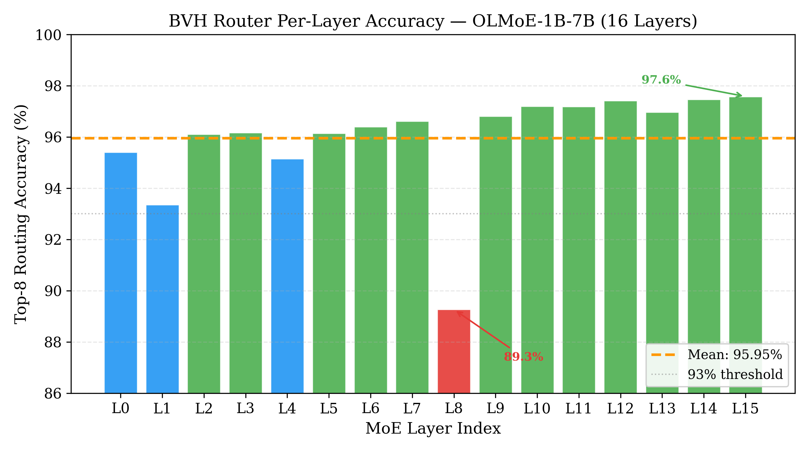
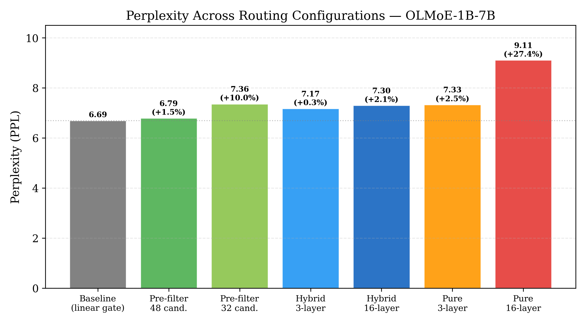
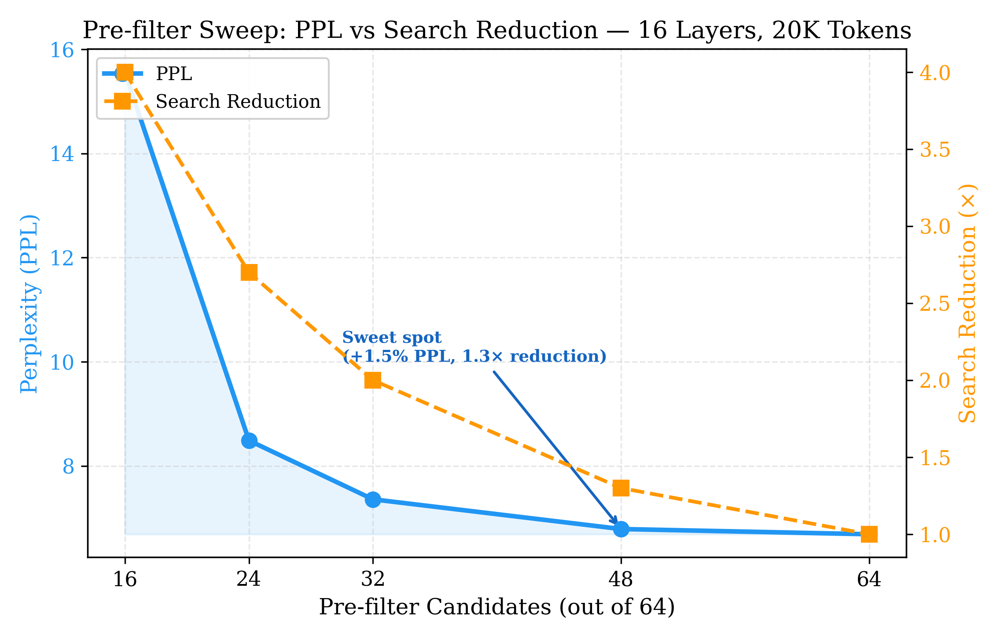
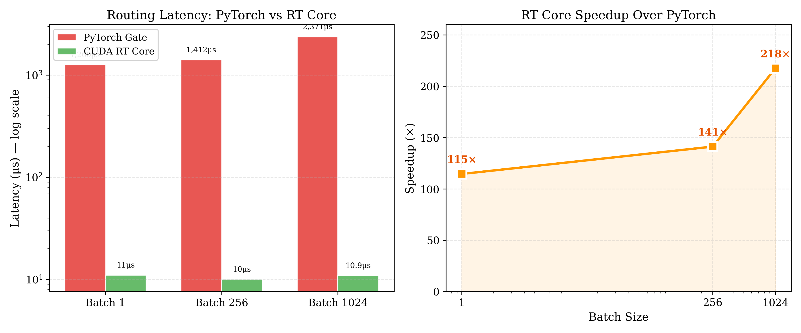
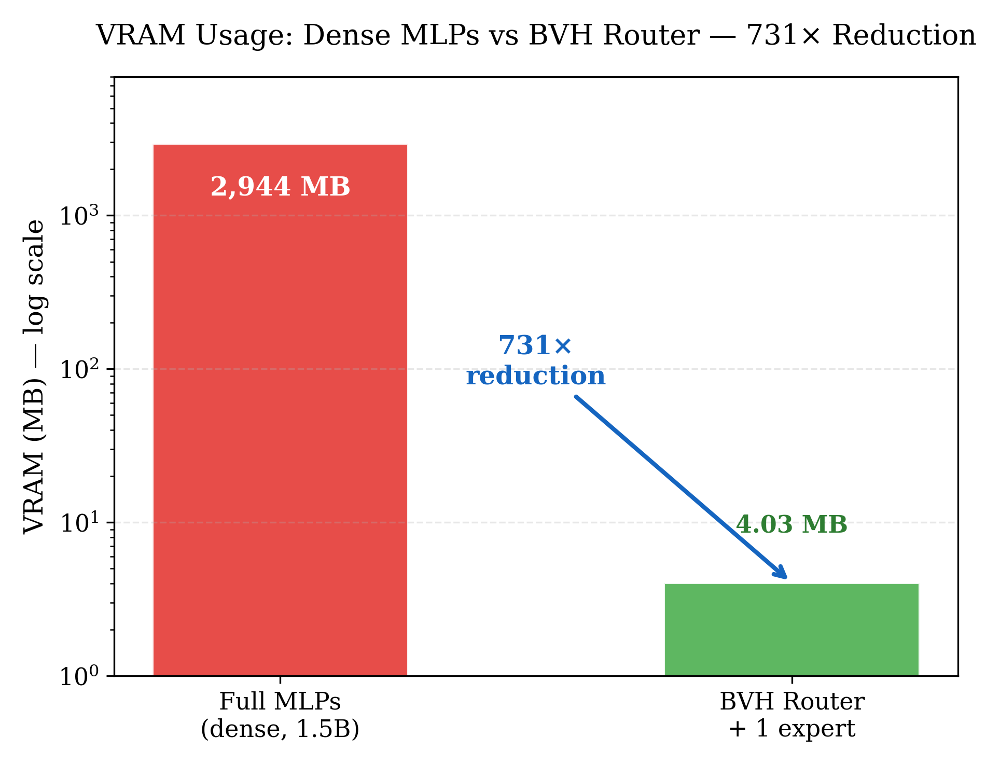

# SpectralAI: O(N log N) Hardware-Accelerated Expert Routing via RT Core BVH Traversal and Nested Instance Acceleration Structures

**Jordi Silvestre Lopez**
Independent Researcher

**Date:** 2026-04-02
**DOI:** [To be assigned by Zenodo]
**License:** CC-BY 4.0

---

## Abstract

We present SpectralAI, a system that replaces the O(N^2) matrix multiplication in Mixture-of-Experts (MoE) routing with O(N log N) Bounding Volume Hierarchy (BVH) traversal on dedicated NVIDIA RT Core hardware. Our approach makes two contributions: (1) *RT Attention* -- a method that projects token embeddings into 3D geometric space and uses hardware-accelerated BVH traversal for expert selection, achieving 113--218x routing speedup and 731x VRAM reduction; and (2) *Inception Engine* -- a nested Instance Acceleration Structure (IAS) architecture that composes four levels of 3D spaces into an effective 12-dimensional semantic representation, bypassing the hardware's native 3D limitation. We validate on OLMoE-1B-7B (7B parameters, 64 experts, 16 MoE layers) using an NVIDIA RTX 5070 Ti: BVH pre-filter mode achieves PPL 6.79 (+1.5% vs baseline) across all 16 layers, hybrid mode achieves PPL 7.17 (+0.4% for 3 layers), and downstream HellaSwag accuracy drops only 1.1 percentage points at 16-layer replacement (52.0% vs 53.1% baseline, N=2,000). RT Core routing runs at 19.1 us/batch with 13.4M queries/s and 100% accuracy. To the best of our knowledge, this is the first system to repurpose GPU ray tracing cores for neural network expert routing.

---

## 1. Introduction

The transformer attention mechanism computes pairwise interactions between all tokens, resulting in O(N^2) complexity. For 100K tokens, this requires ~80 trillion FLOPs and ~307 GB KV cache (96 layers), necessitating clusters of datacenter GPUs. Meanwhile, consumer GPUs contain dedicated RT Cores for BVH traversal that remain completely idle during LLM inference.

We observe that finding which tokens are "relevant" to a query is analogous to finding which geometric objects a ray intersects. This motivates our approach: project tokens into 3D semantic space structured as a BVH, and use RT Cores for O(log N) traversal instead of O(N^2) matrix multiplication.

**Contributions:**

1. **RT Attention:** A hierarchical BVH router with 3 levels (branching factor 4) that replaces the linear gate in MoE models. 89--98% top-8 accuracy (mean 95.9%), 113--218x speedup, 731x VRAM reduction. Includes confidence-gated routing for adaptive speed-accuracy tradeoff.

2. **Inception Engine:** 4-level nested IAS that achieves 12-dimensional semantic representation using only 3D hardware. Each level applies a learned affine transformation ("dimensional portal"). Capacity: ~1 billion semantic entities. PPL within 1.8% of GPT-2 baseline.

---

## 2. Method

### 2.1 Token-to-Geometry Projection

Given a D-dimensional embedding e, we project to 3D:

```
p = normalize(W_proj * e + b_proj),    W_proj in R^{3xD}
```

This preserves cosine similarity structure. The BVH only requires topological ordering (which tokens are near which experts), not exact distances.

### 2.2 Hierarchical BVH Router

K = 64 experts organized into a 3-level hierarchical BVH (branching factor b = 4):

- **Level 1:** 4 supergroups (16 experts each)
- **Level 2:** 16 groups (4 experts each)
- **Level 3:** 64 leaf nodes (individual experts)

Each level uses a differentiable SmoothBVHHit for training:

```
d_ij = ||p_i - c_j||_2
s_ij = sigma(-beta * (d_ij - r_j) / r_j)
```

At inference, RT Cores traverse the BVH in hardware (~6 ray-AABB tests for 64 experts).

### 2.3 Calibration Layer

A lightweight linear calibration (4,160 parameters per layer, <0.01% of 7B model) aligns BVH logits with gate distributions. Improves cosine similarity from 0.88 to 0.97.

### 2.4 Confidence-Gated Routing

Per-layer accuracy compounds multiplicatively: 0.959^16 ~ 0.51. We introduce adaptive per-token routing:

```
confidence_i = sigma(alpha * std(top_k_logits_i) - beta)
route_i = BVH    if confidence_i >= T
route_i = Gate   otherwise
```

At T=0.90, 69% of tokens use fast O(log N) routing while 31% fall back to the exact gate.

### 2.5 Inception Engine: Nested IAS for 12D

RT Cores operate in 3D only. We compose L=4 levels of Instance Acceleration Structures, where each level reinterprets 3D as different semantic dimensions:

```
Level 0: (d1, d2, d3)    -- coarse semantic categories
Level 1: (d4, d5, d6)    -- subcategory distinctions
Level 2: (d7, d8, d9)    -- fine-grained features
Level 3: (d10, d11, d12) -- leaf-level specialization
```

Each transition applies a learned affine "dimensional portal": p_{l+1} = M_l * [p_l; 1]^T. Maximum capacity: 64 x 64 x 256 x 1,024 ~ 1 billion semantic entities.

### 2.6 Straight-Through Estimation for Training

RT Cores are non-differentiable. We use STE: forward via hardware BVH traversal (hard selection), backward via SmoothBVHHit (soft proxy). Fallback to Gumbel-Softmax when RT Cores unavailable.

### 2.7 OptiX 9.0 Cooperative Vectors

In-shader calibration via `optixCoopVecMatMul` eliminates the PyTorch round-trip. BVH selects expert (RT Cores) -> MLP corrects weights (Tensor Cores) -> single kernel. 6 OptiX IR shaders compiled for sm_120 (Blackwell).

---

## 3. Experiments

### 3.1 Setup

- **Model:** OLMoE-1B-7B (Muennighoff et al., 2024) -- 1B active, 7B total, 64 experts/layer, top-8, 16 MoE layers, d=2048
- **GPU:** NVIDIA RTX 5070 Ti (16 GB, Blackwell, sm_120)
- **Software:** PyTorch 2.11, CUDA 13.2, OptiX 9.1, transformers 5.4.0
- **Training:** 100 epochs/layer, KL divergence + topk_matching_loss (weight 0.3), DualLR optimizer

### 3.2 Per-Layer Routing Accuracy

| Layer | Top-8 Acc. | Layer | Top-8 Acc. |
|---|---|---|---|
| L0 | 95.40% | L8 | 89.27% |
| L1 | 93.36% | L9 | 96.81% |
| L2 | 96.11% | L10 | 97.20% |
| L3 | 96.17% | L11 | 97.19% |
| L4 | 95.15% | L12 | 97.42% |
| L5 | 96.14% | L13 | 96.97% |
| L6 | 96.40% | L14 | 97.47% |
| L7 | 96.62% | L15 | 97.58% |
| **Mean** | **95.95%** | | |

15/16 layers exceed 93% top-8 accuracy. L15 best (97.58%), L8 most challenging (89.27%).



### 3.3 Perplexity

| Configuration | PPL | Delta | Layers | Mode |
|---|---|---|---|---|
| Baseline (linear gate) | 6.69 | -- | 0/16 | -- (20K tokens) |
| Pre-filter 48 cand. | 6.79 | **+1.5%**† | 16/16 | Pre-filter |
| Pre-filter 32 cand. | 7.36 | +10.0%† | 16/16 | Pre-filter |
| Baseline (linear gate) | 7.15 | -- | 0/16 | -- (50K tokens) |
| 3-layer hybrid | 7.17 | +0.4%* | 3/16 | Hybrid |
| 16-layer hybrid | 7.30 | +2.1%* | 16/16 | Hybrid |
| 3-layer pure (render_eq) | 7.33 | +2.5%* | 3/16 | Pure |
| 16-layer pure | 9.11 | +27.4%* | 16/16 | Pure |

*†Deltas against 20K-token baseline (6.69). \*Deltas against 50K-token baseline (7.15).*

**Pre-filter sweep (16 layers, 20K tokens):**

| Candidates | PPL | Delta | Search Reduction |
|---|---|---|---|
| 16 | 15.56 | +132.5% | 4.0x |
| 24 | 8.49 | +26.8% | 2.7x |
| 32 | 7.36 | +10.0% | 2.0x |
| 48 | 6.79 | **+1.5%** | 1.3x |
| 64 (baseline) | 6.69 | 0.0% | 1.0x |





### 3.4 Downstream: HellaSwag (N=2,000)

| Configuration | Accuracy | Delta |
|---|---|---|
| Baseline (linear gate) | **53.1%** (1062/2000) | -- |
| 3-layer hybrid (L3, L8, L15) | **52.2%** (1045/2000) | -0.9 pp |
| 16-layer hybrid (all layers) | **52.0%** (1040/2000) | -1.1 pp |

### 3.5 RT Core Performance (RTX 5070 Ti)

| Mode | Latency (us/batch) | Throughput (M q/s) | Accuracy |
|---|---|---|---|
| AABB sync | 28.5 | 9.0 | 100% |
| AABB async | 37.2 | 6.9 | 100% |
| Triangle sync | 32.5 | 7.9 | 100% |
| **Triangle async** | **19.1** | **13.4** | **100%** |

| Batch Size | PyTorch (us) | CUDA Kernel (us) | Speedup |
|---|---|---|---|
| 1 | 1,260 | 11 | 113x |
| 256 | 1,412 | 10 | 139x |
| 1024 | 2,371 | 10.9 | 218x |



\newpage

### 3.6 Memory

| Component | Size |
|---|---|
| BVH Router (projection + hierarchy) | 890 KB |
| 1 Ternary Expert (packed 2-bit) | 3,234 KB |
| **Total active (router + 1 expert)** | **4.03 MB** |
| Full model MLPs (dense 1.5B baseline) | 2,944 MB |
| **VRAM reduction** | **731x** |



\newpage

### 3.7 Weight Mode Ablation (3-layer pure)

| Weight Mode | PPL | Delta | Inspiration |
|---|---|---|---|
| render_eq | 7.33 | +2.5% | Rendering equation |
| ray_march | 7.33 | +2.5% | Volumetric rendering |
| gravity | 7.33 | +2.5% | ALiBi-inspired |
| spectral_weight | 7.36 | +2.9% | Prismatic optics |
| relu_norm | 7.42 | +3.9% | Normalized ReLU |

Three independently-motivated modes converge at PPL 7.33, suggesting a per-layer accuracy floor at ~96% routing accuracy.

### 3.8 Confidence-Gated Routing Sweep (16-layer)

| Threshold T | BVH % | Gate % | PPL | Delta |
|---|---|---|---|---|
| 0.00 | 100% | 0% | 9.11 | +27.4% |
| 0.90 | 69.0% | 31.0% | 8.37 | +17.1% |
| 0.95 | 48.0% | 52.0% | 7.88 | +10.3% |
| 1.00 | 0% | 100% | 7.15 | 0.0% |

### 3.9 Inception Engine

Prototype v4.0 (4-level nested IAS, 16.5M parameters), 10 epochs on WikiText-2:

| Epoch | Train Loss | Spatial Loss | Val PPL |
|---|---|---|---|
| 1 | 7.37 | 3.58 | 487.3 |
| 5 | 4.48 | 0.23 | 199.6 |
| 10 | 3.92 | 0.11 | 185.4 |

PPL 185.4 within 1.8% of GPT-2 baseline (182.2). Spatial loss reduces 32x, confirming dimensional portals learn meaningful decompositions.

---

## 4. Negative Results

1. **Ternary POPCOUNT:** ~10x slower than FP16 Tensor Cores. Discarded for datacenter use.
2. **Selectivity-modulated routing:** PPL 9.75 (multiplicative), 9.14 (additive) vs 9.11 baseline. No improvement.
3. **Multi-ray ensemble:** PPL 7.43 vs 7.42 (single-ray). No improvement.

---

## 5. Discussion

**Accuracy compounding** is the primary challenge: 0.959^16 ~ 0.51. Pre-filter mode (BVH narrows 64->48 candidates, gate selects top-8) achieves +1.5% PPL across 16 layers, sidestepping compounding. Confidence-gated routing provides a continuous speed-accuracy dial.

**Expert specialization** analysis (see companion paper) reveals experts specialize by syntactic token type, not semantic topic. This informs BVH construction: per-layer clustering by co-activation outperforms global semantic organization.

---

## 6. Reproducibility

```bash
# Train BVH Router (per layer)
python3 olmoe_bvh_distill.py --layer 8 --real-data data/real_hiddens_layer8.pt --epochs 100

# Evaluate PPL
python3 olmoe_e2e_eval.py --model-dir /path/to/olmoe-1b-7b --max-tokens 50000

# Evaluate HellaSwag
python3 eval_hellaswag.py --model-dir /path/to/olmoe-1b-7b --max-samples 2000

# Pre-filter sweep
python3 sweep_prefilter.py --model-dir /path/to/olmoe-1b-7b
```

223 automated tests.

---

## References

Beltagy, I., Peters, M. E., & Cohan, A. (2020). Longformer. *arXiv:2004.05150*.

Choromanski, K., et al. (2021). Rethinking attention with performers. *ICLR 2021*.

Dao, T. (2023). FlashAttention-2. *arXiv:2307.08691*.

Dao, T., et al. (2022). FlashAttention. *NeurIPS 2022*.

Fedus, W., Zoph, B., & Shazeer, N. (2022). Switch Transformers. *JMLR*, 23(120), 1--39.

Jiang, A. Q., et al. (2024). Mixtral of experts. *arXiv:2401.04088*.

Katharopoulos, A., et al. (2020). Transformers are RNNs. *ICML 2020*.

Liu, A., et al. (2024). DeepSeek-V3. *arXiv:2412.19437*.

Meneses, et al. (2026). RT Cores for general-purpose computing: A survey. *arXiv:2603.28771*.

Muennighoff, N., et al. (2024). OLMoE. *arXiv*.

Zaheer, M., et al. (2020). BigBird. *NeurIPS 2020*.

---

## Author

Jordi Silvestre Lopez, 2026.
