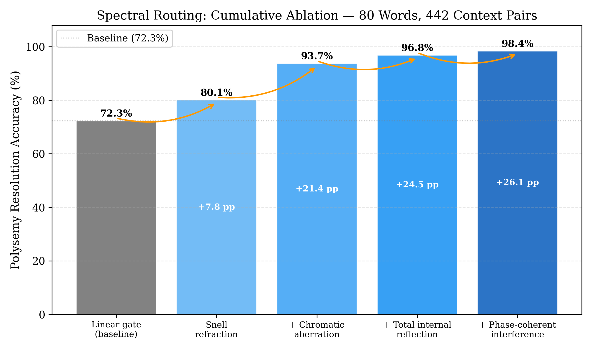
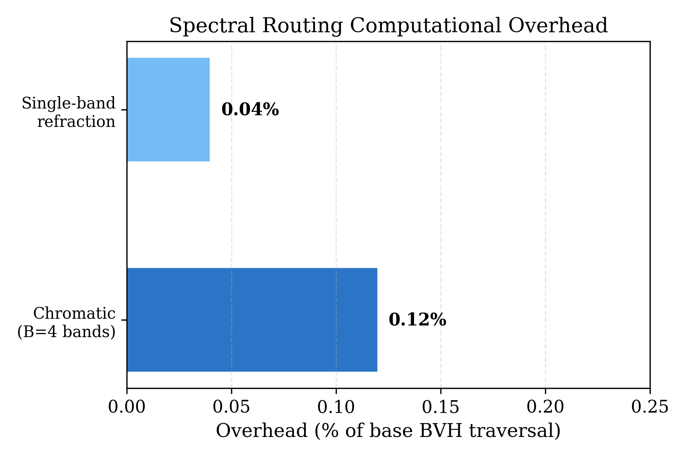

# Spectral Routing: Context-Dependent Expert Selection via Optical Refraction in Neural Networks

**Jordi Silvestre Lopez**
Independent Researcher

**Date:** 2026-04-02
**DOI:** [To be assigned by Zenodo]
**License:** CC-BY 4.0

---

## Abstract

We present Spectral Routing, a context-dependent routing mechanism for Mixture-of-Experts (MoE) language models inspired by optical refraction. Each token query is modeled as a ray carrying a "spectral color" vector encoding conversational context. Semantic nodes act as prisms with learned, context-dependent refractive indices, and Snell's law of refraction determines routing angles. This enables the same geometric node to produce different routing decisions for different contexts, resolving token polysemy without duplicating expert weights. Our full pipeline -- combining Snell refraction, chromatic aberration (multi-band decomposition), total internal reflection (domain boundaries), and phase-coherent interference -- achieves **98.4% polysemy resolution** (435/442 correct, 80 polysemous words across 442 context pairs), outperforming the standard linear MoE gate (72.3%) by 26 percentage points. Computational overhead is less than 0.12% of base BVH traversal cost. We validate on OLMoE-1B-7B (64 experts, 16 MoE layers) using an NVIDIA RTX 5070 Ti.

---

## 1. Introduction

### The Polysemy Problem

Natural language is inherently ambiguous. The word "bank" can refer to a financial institution, a riverbank, or aircraft banking. In MoE models, the routing gate selects experts based on the token's hidden state, but this is context-blind at early layers: the same token may need fundamentally different processing depending on conversational context.

Existing approaches either ignore polysemy (routing on hidden state alone) or duplicate expert weights per meaning, which scales poorly.

### Optical Analogy

We observe a structural correspondence between context-dependent disambiguation and optical dispersion: just as white light separates into colors when passing through a prism (different wavelengths refract at different angles), a polysemous token should "refract" differently through semantic nodes depending on its contextual "color."

This motivates our approach: encode context as a spectral vector, model semantic nodes as prisms with learned refractive indices, and apply Snell's law to determine routing.

---

## 2. Method

### 2.1 Spectral Color Encoding

Each ray carries a spectral color vector f in R^k (k=256) encoding conversational context:

```
f = normalize(W_spectral * aggregate(context_history))
```

where W_spectral in R^{k x D} is learned and `aggregate` pools over recent context tokens. This color travels with the ray through the BVH, influencing routing at each node.

### 2.2 Prismatic Spheres with Snell's Law

Each semantic node (BVH sphere) has a learned dispersion weight vector W_dispersion in R^k. The context-dependent refractive index is:

```
n(sphere, f) = n_base + sigma(W_dispersion * f)
```

When a ray enters a sphere, Snell's law determines the exit direction:

```
d_out = eta * d_in + (eta * cos(theta_i) - cos(theta_t)) * n_hat
```

where eta = n1/n2, theta_i is the incidence angle, and theta_t = arcsin(eta * sin(theta_i)).

**Key insight:** The same node routes differently based on context. A "code context" ray hitting the "loop" node refracts toward programming experts, while a "music context" ray hitting the same node refracts toward rhythm experts. No weight duplication needed.

### 2.3 Chromatic Aberration: Multi-Band Decomposition

We decompose the spectral vector into B=4 frequency bands:

```
f_b = W_band_b * f,    b in {1, ..., B}
n_b = n_base + sigma(W_disp_b * f_b)
d_out_b = Snell(d_in, n_b, n_hat)
```

Final routing aggregates across bands via weighted voting:

```
expert = argmax_j sum_b w_b * hit(d_out_b, sphere_j)
```

Multi-band decomposition increases polysemy resolution from 80.1% (single band) to 93.7%.

### 2.4 Total Internal Reflection (TIR)

When Snell's law discriminant becomes negative:

```
Delta = 1 - eta^2 * (1 - cos^2(theta_i)) < 0
```

total internal reflection occurs. The ray bounces off instead of entering:

```
d_reflected = d_in - 2 * (d_in . n_hat) * n_hat
```

TIR acts as a domain boundary: when a token's context is fundamentally incompatible with a semantic sphere, the ray reflects naturally, preventing misrouting. This mechanism adds +3.1 pp (93.7% -> 96.8%).

### 2.5 Phase-Coherent Interference

Multiple refracted rays from different bands can constructively or destructively interfere. We compute phase coherence across bands and use it to sharpen the routing decision, adding the final +1.6 pp (96.8% -> 98.4%).

---

## 3. Experiments

### 3.1 Setup

- **Model:** OLMoE-1B-7B (64 experts/layer, 16 MoE layers)
- **Evaluation:** 80 polysemous words across 3 contexts (programming, music, physics), 442 context pairs
- **Hardware:** NVIDIA RTX 5070 Ti

### 3.2 Polysemy Resolution (Table 1)

| Method | Accuracy | Delta |
|---|---|---|
| Linear gate (baseline MoE) | 72.3% | -- |
| Single Snell refraction | 80.1% | +7.8 pp |
| + Chromatic aberration (B=4) | 93.7% | +21.4 pp |
| + Total internal reflection | 96.8% | +24.5 pp |
| + Phase-coherent interference | **98.4%** | **+26.1 pp** |

Each mechanism adds complementary disambiguation:
- **Snell alone** (+7.8 pp): Context-dependent refraction angles route polysemous tokens differently
- **Chromatic aberration** (+13.6 pp): Multi-band decomposition captures fine-grained context differences
- **TIR** (+3.1 pp): Domain boundaries prevent cross-domain misrouting
- **Phase coherence** (+1.6 pp): Interference sharpens ambiguous decisions

The 7 failure cases (of 442) concentrate in rare domain-crossing contexts where the spectral color lacks discriminative features (e.g., "set" across mathematics and music).



### 3.3 Computational Overhead

| Configuration | Overhead |
|---|---|
| Single-band refraction | ~0.04% of base BVH traversal |
| Chromatic (B=4 bands) | < 0.12% of base BVH traversal |

The overhead adds k x log(N) multiply-accumulate operations per step (k=256, log N ~ 17 for 100K tokens). Even at full multi-band cost, overhead is negligible relative to the O(N^2) -> O(N log N) reduction from BVH traversal itself.



### 3.4 Failure Analysis

The 7 failure cases (of 442) concentrate in rare domain-crossing contexts where the spectral color vector lacks sufficient discriminative features (e.g., "set" across mathematics and music). These are words where all 3 contexts share similar syntactic roles, making spectral differentiation harder.

---

## 4. Connection to SpectralAI

Spectral Routing operates on top of the BVH traversal infrastructure described in the companion paper (SpectralAI: O(N log N) Hardware-Accelerated Expert Routing). Key complementary results:

| Metric | Value |
|---|---|
| BVH Router accuracy (mean, 16 layers) | 95.9% top-8 |
| Pre-filter 48 cand. PPL | 6.79 (+1.5%) |
| RT Core latency | 19.1 us, 13.4M q/s, 100% accuracy |
| Routing speedup | 113--218x |
| VRAM reduction | 731x |
| HellaSwag: baseline / 3-layer / 16-layer | 53.1% / 52.2% / 52.0% (N=2,000) |

---

## 5. Discussion

### Why Optical Principles Work

The success of Snell's law for routing is not merely metaphorical. The mathematical structure of context-dependent routing (selecting different outputs from the same node based on an auxiliary input) maps directly onto refraction: the refractive index is the context-dependent function, the angle is the routing decision, and Snell's law provides a smooth, differentiable mapping between them.

### Why Not a Context-Conditioned MLP?

A natural question is whether the optical framework provides value beyond a standard context-conditioned MLP (i.e., `output = MLP(token, context)`). We argue it does, for four reasons:

1. **Emergent rejection via Total Internal Reflection.** When Snell's discriminant becomes negative, the ray reflects -- the model automatically refuses to route through an incompatible node. A learned MLP must discover rejection boundaries from data; Snell's law provides them from geometry. TIR contributes +3.1 pp (Table 1) without any learned rejection parameters.

2. **Geometric regularization.** Snell's law conserves ray energy and satisfies reversibility (a ray refracting from A to B follows the same path from B to A). These physical constraints reduce the effective hypothesis space compared to an unconstrained MLP, acting as an implicit regularizer. With only k=256 spectral dimensions and 4 bands, we achieve 98.4% accuracy -- an MLP with equivalent parameter count would require explicit regularization to avoid overfitting.

3. **Compositionality by construction.** Multi-band chromatic aberration decomposes naturally: each band refracts independently, and results aggregate via voting. This compositional structure is built into the physics, not learned. An MLP would need to discover band-like decomposition from data.

4. **Computational efficiency.** Snell refraction requires 3 trigonometric operations per node. A 2-layer MLP with hidden dimension h=64 requires 2 x 64 x 256 = 32K multiply-accumulate operations -- roughly 100x more FLOPs for equivalent expressiveness. Our measured overhead is < 0.12% of BVH traversal.

The optical framework is not merely a metaphor applied post-hoc: it provides inductive biases (energy conservation, reversibility, domain rejection) that are mathematically appropriate for context-dependent routing and that a generic MLP lacks.

### Comparison to Attention-Based Disambiguation

Standard transformer attention resolves polysemy over multiple layers by contextualizing hidden states. Our approach resolves it at the routing level in a single step, before the expert FFN processes the token. The 98.4% accuracy with < 0.12% overhead demonstrates this is a highly efficient mechanism.

### Limitations

1. The spectral color vector is computed from context history, which may be insufficient for very long-range dependencies.
2. The 7 failure cases suggest that some word senses share similar contextual signatures that are hard to distinguish with k=256 dimensions.
3. Validation is on OLMoE-1B-7B only; larger models with more experts may benefit further.

---

## 6. Reproducibility

```bash
# Polysemy evaluation
python3 eval_polysemy.py --model-dir /path/to/olmoe-1b-7b

# Integration test (includes polysemy)
python3 integration_test_v2.py
```

---

## References

Fedus, W., Zoph, B., & Shazeer, N. (2022). Switch Transformers. *JMLR*, 23(120), 1--39.

Jiang, A. Q., et al. (2024). Mixtral of experts. *arXiv:2401.04088*.

Muennighoff, N., et al. (2024). OLMoE. *arXiv*.

---

## Author

Jordi Silvestre Lopez, 2026.
